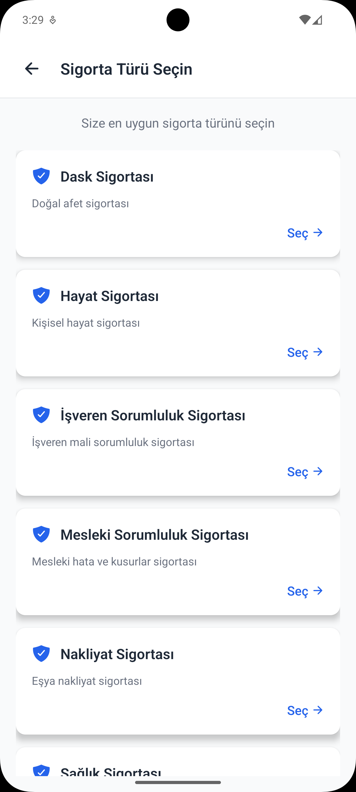
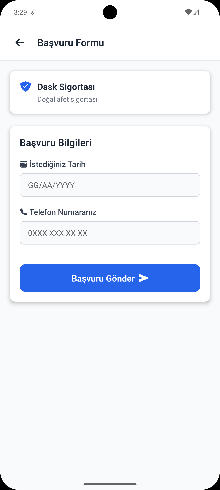
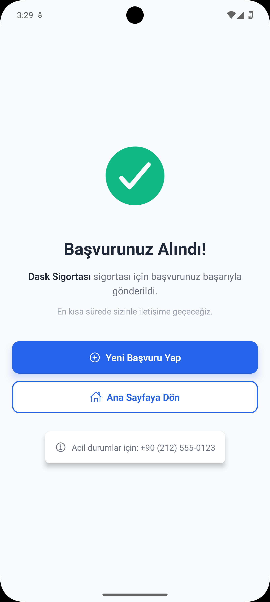
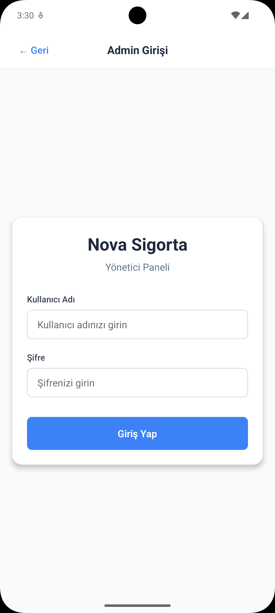
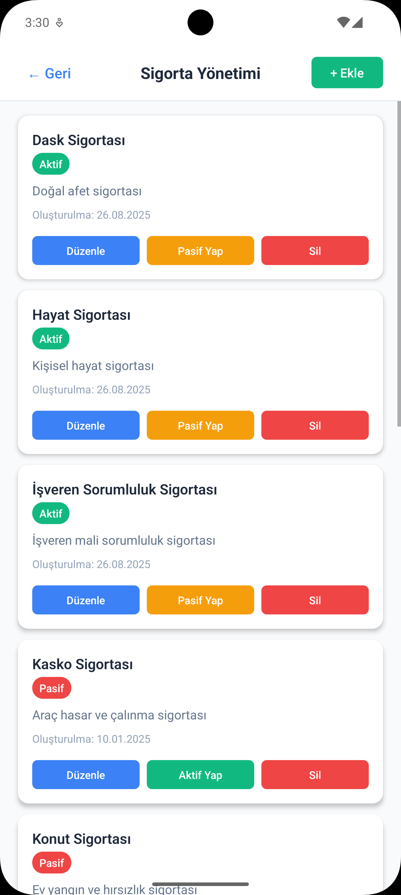
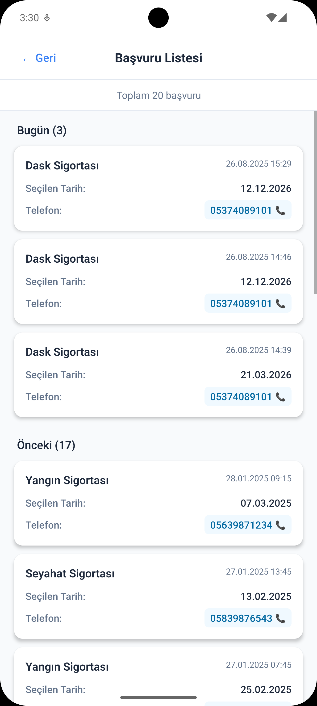
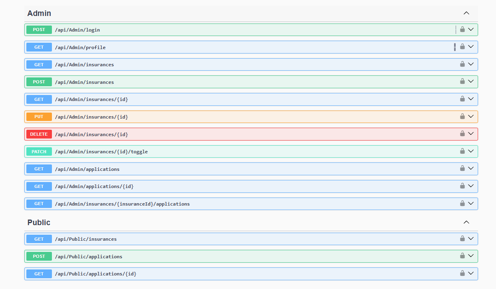

# 🛡️ Nova Sigorta

**Modern sigorta yönetim sistemi**

Nova Sigorta, .NET Clean Architecture backend, React web sürümü ve React Native mobil uygulaması ile geliştirilen bir sigorta başvuru ve yönetim platformudur.

---

## 🚀 Özellikler

### 🎯 **Backend (.NET 8)**
- **Clean Architecture** - Domain, Application, Infrastructure, API katmanları
- **JWT Authentication** - Güvenli admin girişi
- **PostgreSQL** - Performanslı veritabanı
- **Swagger Documentation** - Kapsamlı API dokümantasyonu
- **Repository Pattern** - Esnek veri erişim katmanı

### 💻 **Web Admin Panel (React)**
- **Dashboard** - İstatistikler ve genel bakış
- **Sigorta Yönetimi** - CRUD işlemleri
- **Başvuru Takibi** - Başvuru listesi ve filtreleme
- **Responsive Design** - Tüm cihazlarda uyumlu

### 📱 **Mobil Uygulama (React Native)**
- **Kullanıcı Uygulaması** - Sigorta başvuru sistemi
- **Admin Uygulaması** - Mobil yönetim paneli
- **Cross Platform** - iOS ve Android desteği

---

## 📱 Mobil Uygulama

### Kullanıcı Deneyimi
<div align="center">
  
  
</div>

<div align="center">
  
  
</div>

### Admin Paneli
<div align="center">
  
  
</div>

<div align="center">
  
  
</div>

---

## 🔧 API Dokümantasyonu

<div align="center">
  
</div>

---

## 🛠️ Teknoloji Stack

### Backend
- **.NET 8** - Modern framework
- **PostgreSQL** - Güvenilir veritabanı
- **Entity Framework Core** - ORM
- **JWT** - Authentication
- **Swagger** - API dokümantasyonu

### Frontend
- **React 19** - Modern UI library
- **Next.js 15** - Full-stack framework
- **TypeScript** - Type safety
- **Tailwind CSS** - Responsive design

### Mobile
- **React Native** - Cross-platform development
- **Expo** - Development platform
- **TypeScript** - Type safety
- **React Navigation** - Navigation system

---

## 🚀 Kurulum

### 1. Backend (.NET)
```bash
cd src/NovaSigorta.API
dotnet restore
dotnet run
```

### 2. Web Admin Panel
```bash
cd frontend/admin-panel
npm install
npm run dev
```

### 3. Mobil Uygulama
```bash
cd mobile
npm install
expo start
```

---

## 📋 Kullanım

### Admin Girişi
- **Kullanıcı Adı:** `halil`
- **Şifre:** `ee04df74ba`

### API Endpoint'leri
- **Swagger UI:** `http://localhost:5260/swagger`
- **Base URL:** `http://localhost:5260/api`

### Web Admin Panel
- **URL:** `http://localhost:3000`
- **Admin Panel:** `http://localhost:3000/login`

---

## 🎯 Özellik Detayları

### ✅ Tamamlanan Özellikler
- [x] JWT Authentication sistemi
- [x] Sigorta CRUD işlemleri
- [x] Başvuru yönetimi
- [x] Admin dashboard
- [x] Responsive web arayüzü
- [x] Cross-platform mobil uygulama
- [x] API dokümantasyonu
- [x] PostgreSQL entegrasyonu
